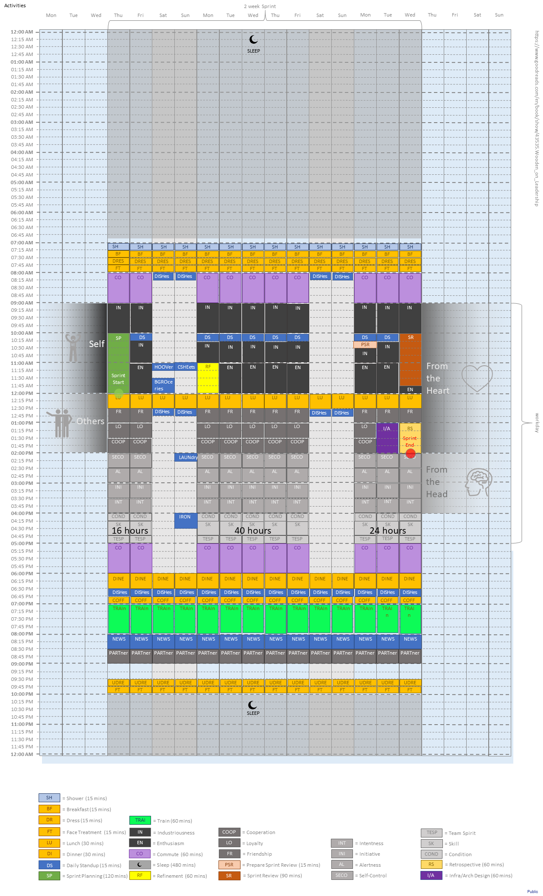

productivity-headstart
# Productivity - Headstart

See also "Productivity" DAKBoard at https://www.dakboard.com/screen/uuid/5fae8376-113569-0cf9-973b98129210

## [BF] Breakfast

## [CO] Commute

### Comute Up

See also Bring! at https://web.getbring.com/app/lists/2

### Commute Down

See also Bring! at ...

## [PSR] Prepare Sprint Review

See also Bring! at ...

## [RV] Review

See also Bring! at ...

## [IN] Industriousness

See also [README.md](./in/README.md)

See also Bring! at ...

## [SP] Sprint Planning

See also [README.md](./sp/README.md)

See also Bring! at ...

## [DS] Daily Standup

See also [README.md](./ds/README.md)

See also Bring! at ...

## [EN] Enthusiasm

See also [README.md](./en/README.md)

See also Bring! at ...

## [RF] Refinement

See also Bring! at ...

## [LU] Lunch

See also Bring! at ...

## [FR] Friendship

See also Bring! at ...

## [I/A] Infra/Arch Design

See also Bring! at ...

## [RT] Retrospective

See also Bring! at ...

## [LO] Loyalty

See also Bring! at ...

## [COOP] Cooperation

See also Bring! at ...

## [SECO] Self-Control

See also Bring! at ...

## [AL] Alertness

See also Bring! at ...

## [INI] Initiative

See also Bring! at ...

## [INT] Intentness

See also Bring! at ...

## [COND] Condition

See also Bring! at ...

## [SK] Skill

See also Bring! at ...

## [TESP] Team Spirit

See also Bring! at ...

## [DI] Dinner

See also Bring! at ...

## [SL] Sleep

See also Bring! at ...
